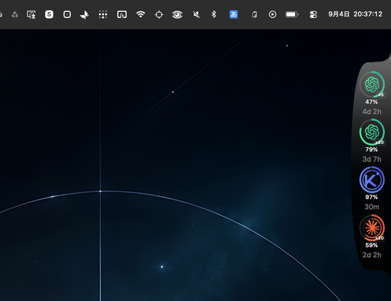
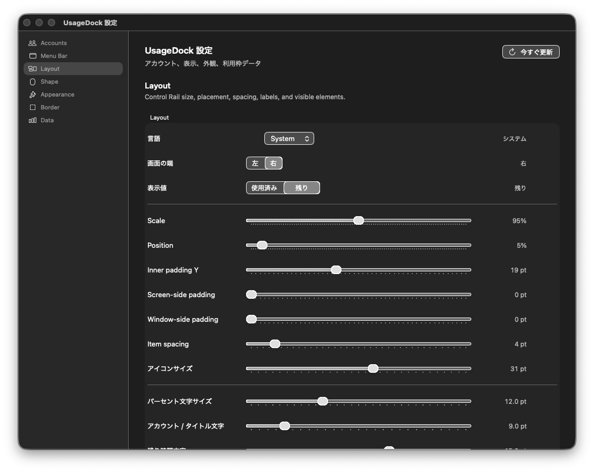

<p align="center">
  <a href="README.md">English</a> ·
  <a href="README.ja.md"><strong>日本語</strong></a> ·
  <a href="README.zh-CN.md">简体中文</a> ·
  <a href="README.zh-TW.md">繁體中文</a> ·
  <a href="README.ko.md">한국어</a> ·
  <a href="README.es.md">Español</a>
</p>

# UsageDock

AIを使っている最中に、「あとどれくらい使える？」を確認するためだけにブラウザへ戻る。サービスごとに別の画面を開き、利用率とリセット時刻を見て、また作業へ戻る。

UsageDockは、その往復を減らすためのmacOS向けエッジレールです。

Claude、Codex、Antigravity、Kimiなどの利用状況を、画面の端とメニューバーに常駐させます。大きなダッシュボードを開く代わりに、必要な情報だけを視界の端へ置く。使うときだけ詳しく見て、普段は邪魔をしない。それがUsageDockの役割です。

## 動いているところを見る

<a href="https://drive.google.com/file/d/1I1TLPKhvvgevAjZ8R0ceHMxTLhVdE_f0/preview">
  
</a>

**▶ [UsageDockの動作デモを見る](https://drive.google.com/file/d/1I1TLPKhvvgevAjZ8R0ceHMxTLhVdE_f0/preview)**

レールは単に固定されたウィジェットではありません。画面端から引っ張ると形が伸び、表面張力のように変形し、切り離された後は水滴が落ちます。左右の画面端へ移動するときも、設定パネルを開くときも、常駐UIとしての軽さを崩さないことを重視しています。

## 実際の画面

### エッジレール


利用率、リング、リセットまでの時間を、作業中に読み取れる密度へまとめています。最大3アカウントまで表示でき、アカウントごとに色や参照する利用枠を変えられます。

### 設定



見た目だけを変える設定画面ではありません。表示対象、レイアウト、リング、時刻、枠線、マテリアル、液体表現、メニューバー表示まで、常駐UIとしての情報量と存在感を調整できます。

## UsageDockでできること

### 利用状況を、作業画面から離れずに確認する

- プロバイダー／アカウント単位の利用状況をエッジレールへ表示
- 利用率のリング・パーセンテージ表示
- リセットまでの時間表示
- 5時間枠、週間枠、モデル固有枠など、複数の利用枠を分けて扱う
- 最大3件の表示アカウントを選択

一つの数字へ無理にまとめるのではなく、性質の違う利用枠は別のものとして扱います。短期枠と週間枠を混ぜれば表示は単純になりますが、判断には使いにくくなるからです。

### メニューバーだけでも確認する

エッジレールとは別に、メニューバーへ表示するアカウントを選べます。

リングだけ、パーセンテージだけ、その両方。必要な情報量に合わせて切り替えられるため、「常にレールを出しておきたい」と「普段はメニューバーだけでいい」を同じ設定へ押し込めません。

### 画面端のUIそのものを調整する

- 左端／右端への配置
- レール内の余白・サイズ・表示密度
- ボーダー、グロー、透明度
- Dark / Light / Monochrome / Spaceなどの外観
- 水滴表現のON/OFF
- 液体のように伸びるドラッグ表現
- 設定変更の永続化

Spaceマテリアルでは、背景へ星や淡い星雲のような質感を加えています。ただ派手に光らせるのではなく、数字やリングの可読性が先です。

## 対応アカウント

UsageDockは**ログインオンリー**です。

| プロバイダー | 状態 | 登録方法 |
|---|---|---|
| Claude | 対応 | 対応する認証済みログイン／セッション |
| Codex | 対応 | 対応する認証済みログイン／セッション |
| Antigravity | 対応 | 対応する認証済みログイン／セッション |
| Kimi | 対応 | 対応する認証済みログイン／セッション |
| Cursor | 未対応 | 検証済みのログイン・利用量取得経路が整うまで無効 |
| Grok | 未対応 | 検証済みのログイン・利用量取得経路が整うまで無効 |

疑似アカウントや手入力の利用率で「動いているように見せる」経路はありません。UsageDockに表示するのは、対応する認証済みログインに結び付いたアカウントだけです。

## 導入

### 必要環境

- macOS 14以降
- Xcode 16以降を推奨

### Releaseビルド

```bash
xcodebuild \
  -project UsageDock.xcodeproj \
  -scheme UsageDock \
  -configuration Release \
  -derivedDataPath DerivedDataRelease \
  build
```

### Debugビルド

```bash
xcodebuild \
  -project UsageDock.xcodeproj \
  -scheme UsageDock \
  -configuration Debug \
  -derivedDataPath DerivedData \
  build
```

起動後は **Settings → Accounts** から対象プロバイダーのログイン操作を行います。認証済みアカウントが登録されると、レール表示用アカウントとメニューバー表示用アカウントをそれぞれ選択できます。

## 設計上の考え方

UsageDockは「AIサービスの管理画面をもう一つ作る」ためのアプリではありません。

必要なのは、作業を止めずに判断できるだけの情報です。そのため、通常時は画面端の小さなレールに留まり、詳細はホバーや設定操作のときだけ開きます。メインパネルもホバー表示も、作業中のウィンドウから不用意にフォーカスを奪わない構成を採っています。

内部では `Provider → Account → UsageBucket` の階層で利用量を扱い、5時間枠、週間枠、モデル固有枠などを別々に保持します。集計できるものだけを集計し、情報が足りない場合に「正確な合計」であるかのようには表示しません。

詳しい設計は [`docs/ARCHITECTURE.md`](docs/ARCHITECTURE.md) にあります。

## プロジェクト構成

- `UsageDock/Domain` — 利用量モデル、集計、レール動作ランタイム
- `UsageDock/Providers` — プロバイダーアダプター、ライブ利用量連携
- `UsageDock/Storage` — 設定とアカウント状態の永続化
- `UsageDock/UI` — エッジレールと設定UI
- `UsageDock/Window` — AppKitパネル／ウィンドウ統合
- `UsageDockTests` — 単体・挙動テスト

利用枠を確認するために作業から離れる時間は、数秒ずつです。ただ、その数秒は一日に何度も発生します。UsageDockは、その確認を「別の作業」にしないための小さな常駐UIです。
